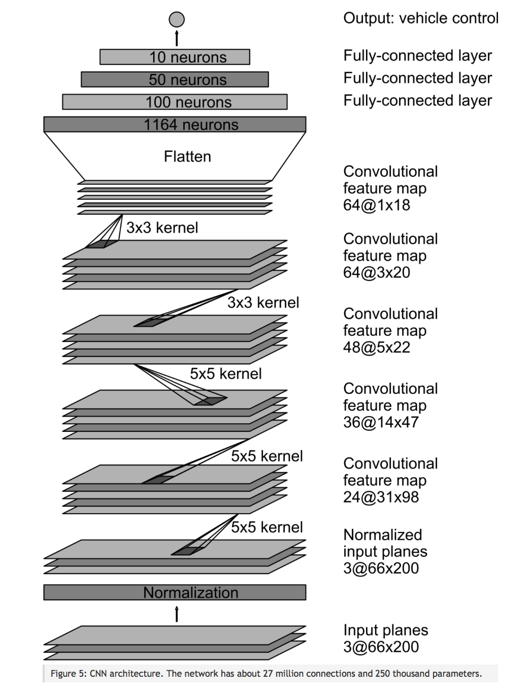
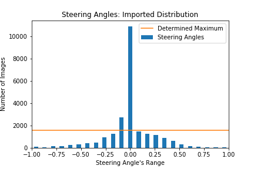
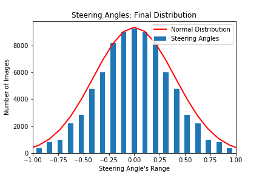
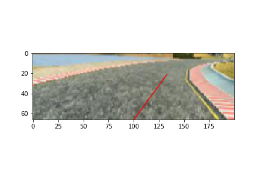
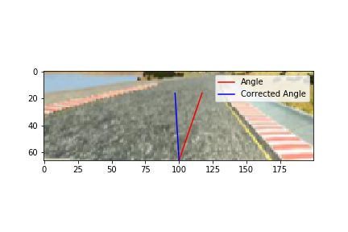
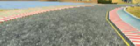

# **Behavioral Cloning** 

**Behavioral Cloning Project**

The goals / steps of this project are the following:
* Use the simulator to collect data of good driving behavior
* Build, a convolution neural network in Keras that predicts steering angles from images
* Train and validate the model with a training and validation set
* Test that the model successfully drives around track one without leaving the road
* Summarize the results with a written report


My project includes the following files:
* model.py containing the script to create and train the model
* model.ipynb containing the ipython notebook similar to model.py with model training and visualizations of the dataset.
* drive.py for driving the car in autonomous mode
* model.h5 containing a trained convolution neural network
* Track1.mp4 recorded video of the car autonomously driving succesfully through Track 1
* Track2.mp4 recorded video of the car autonomously driving succesfully through Track 2


Using the Udacity provided simulator and my drive.py file, the car can be driven autonomously around the track by executing 
```sh
python drive.py model.h5
```

The model.py file contains the code for training and saving the convolution neural network. The file shows the pipeline I used for training and validating the model, and it contains comments to explain how the code works.

#### 1. Model Architecture and Training Strategy

My model is a modified replica of the NVIDIA architecture for end-to-end autonomous driving with 5 Convolutional Layers at first, followed by 3 Fully Connected Layers that produces the output layer as the steering angle prediction. (model.py lines 195-271)

The model includes ELU layers to introduce nonlinearity, and the model's inputs are pre-processed by a Cropping2D layer to crop the images, followed by 2 Keras lambda layers for normalization and resizing. (model.py 199-205). 

#### 2. Attempts to reduce overfitting in the model

1) Data Sets Collected - Including Track2
2) Normalizing the data set's probability density (histograms)
3) Batch Normalization
4) L2 regularization
5) Data Augmentation (brightness/flip/left-right-cameras)
6) Early Stopping of Training
7) Preprocessing (resizing the data and decreasing number of features)

The model was tested with dropout layers but weren't necessary thanks to batch normalization layers.

The model was trained on 80% of the data and validated on the remaining 20% to ensure that the model was not overfitting and to understand the model's performance. The model was tested by running it through the simulator and ensuring that the vehicle could stay on the center of both tracks.

#### 3. Model parameter tuning

The model used an adam optimizer, however the learning rate was attempted to be tuned several times, yet the Adam optimizer default learning rate 0.001 performed the most efficiently. (model.py line 264).

#### 4. Appropriate training data

Training data:
    A vast amount of training data were collected, including the data provided by Udacity. Plus, a collection from Track1 including: a combination of center lane driving, and recovery data with emphasis on the less common spots of the track. Moreover, for regularizing a similar set of Track2 was also included.

For details about how I created the training data, see the next section. 

## **Model Architecture and Training Strategy**

#### Solution Design Approach

My first step was to use a convolution neural network model similar to the NVIDIA's architecture which is relatively small and showed an extremely high performance. At the start of my project, other architectures were experimented also, for example: the convolutional network with Inception modules of GoogLeNet Architecture was imported for feature extraction and 3 Dense layers were added on top, but was very slow and gave similar results to the NVIDIA architecture. Hence, the NVIDIA architecture was chosen and further enhanced, since it wasn't as complicated as GoogLeNet or VGG, and it was way easier to train and prevented overfitting using such a simple architecture; Resembled in the figure below.

<p align="center">

</p>

In order to gauge how well the model was working, I split my image and steering angle data into a training and validation set with 4:1 ratio. I found that my first model had a low mean squared error on the training set but a high mean squared error on the validation set. This implied that the model was overfitting. 

## **Overfitting**
Overfitting was one of the main issues throughout this project:
To combat overfitting, I proceeded with several techniques:

#### 1. Reducing the density of the data from Track 1, through using data from the second track, to avoid overfitting on the first track and avoiding the model to only memorize driving around the first track.

#### 2. Regularizing the data's probability density:
1. Plotted the raw data's histogram:
    * After the collection process, the dataset included 23,926 images. However, after viewing the dataset distribution on a histogram (below) with 23 bins, each representing a range of angles. The steering angles around 0 had significanyly higher density.

<p align="center" height=100 width=100></p>

2. Reduced the amount of data overshooting the scaled average by a range of experimented factors (1 --> 3), and choosing a factor of 1.5 as an optimum; Scaled Average = 1560 image/bin
    * The data was filtered to make the model further generalize on hard angles up to -1 and 1, while maintaining the highest probability at 0, resembling the gaussian bell shape curve distribution. The filtered data had a total of 13,396 images.

<p align="center"></p>

3. Included images captured by the left and right cameras and adjusted the steering angle by a correction factor of 0.2. Plus, I flipped the each of the three images and applied a negative sign to the steering angles.
    * This resulted in 6x the filtered images with a total of 80,376 images. 

<p align="center"></p>

* Although, the highest concentration of data was at the 0 steering angle, however, I think that the distribution resembled in this histogram, is a clean bell shape curve, representation of the steering angles propabilities with zero mean and standard deviation 0.4.
* This normal distribution of data, had a significant impact on the model's performance; cleaned up the noise shown in the car driving unsteadily through the tracks.
    
#### 3. Augmenting the Data: 
1. Through flipping each image and applying a negative sign to its angle.
    * Center Image with Steering Angle: 
        <p align="center"></p>
    * Flipped Center Image with Steering Angle: 
        <p align="center"></p>
2. Using the left and right cameras, and using a correction of 0.2 on the captured images' angles.
    * Image Representing Right Camera - Red Line is imported Steering Angle and Blue Line shows the correction 0.2:
    <p align="center"></p>
3. Introducing a random brightness and dimming to each image to account for shadows and bright sections of each track.
    * Image with random brightness of -30 which dimms the image as shown:
    2<p align="center"></p>
4. Blurring each image with 3x3 kernel to reduce the impact of any textures on the training.
    <p align="center"></p>

#### 4. Batch normalization for each layer, to reduce the covariate shift of the outputs of each layer.

#### 5. Introducing L2 Regularization to each layer's weights of 0.001

#### 6. Used Early Stopping for the training epochs, so that as soon as the Validation Loss stops decreasing the training is terminated.
* The Green Line represents the saved model due to the `save_best_only=True` parameter in Keras `ModelCheckpoint` callback function.
* The Early Stopping Callback function stopped the model at the 6th epoch since the Validation Loss stopped decreasing to avoid overfitting.

<p align="center"></p>

### 7. Preprocessing each input image to the model (including test images):
1. Cropping to avoid learning any features other than the track itself.

<p align="center"></p>

2. Resizing each input to size: 66x200x3. Reducing the number of features input to the model and hence downsizing the model complexity. Through using Keras backend function `ktf.image.resize_nearest_neighbor`.

    * Cropped Image:
    <p align="right"></p>

    * Resized Cropped Image: 
    <p align="right"></p>


## **Training the Model**
After augmenting and preprocessing the data, I modified the NVIDIA architecture slightly by adding an ELU 'Exponential Linear Units' instead of the common RELU.
* ELU introduces non-linearity to the model which solves the vanishing gradient problem
* ELU is better than RELU since it has a mean closer to zero than the RELU which accelerates the training.
* Introducing ELU to the model significantly enhanced its performance and helped the model to converge towards a lower minima.

Moreover, Dropout was tested for regularization, to introduces noise into the model to learn to generalize it and prevent overfitting. Nonetheless with the presence of Batch Normalization, which is a technique mostly to improve optimization and reducing every layer's covariate shift. Batch normalization introduced noise into the model and regularized it enough. Therefore, dropout only slowed down the model training and actually caused the model to underfit.

The final step was to train the model, which trained for 6 epochs and recorded the 5th epoch outcome which had the minimal mean squared loss. 

Then, the simulator was run autonomously to visualize the model's performance on mainly track 1 and track 2 also for further testing and proof that the model didn't only memorize how to drive around the track 1. 

At the end of the process, the vehicle was able to drive autonomously cleanly around both tracks without leaving the road.

## **Final Model Architecture**

The final model architecture (model.py lines 195-271) consisted of a convolution neural network with the following layers and layer sizes: 

| Sections | Layer | Details | 
| :---: | :----------: | :---------------------------------------: |
| 1 | Cropping | Crops image to 76x320 |
| 2 | Resize | Resizes image to 66x200 |
| 3 | Normalization | Normalized pixel values from -1 to 1 |
| 4 | Convolutional 1 | 5x5 Filter, Same Padding, Stride 1 |
| | | Conv Output: 66x200x24 |
| | Batch Normalization | |
| | Activation | ELU |
| | 2x2 Max Pooling | Pool Output: 33x100x24 |
| 5 | Convolutional 2 | 5x5 Filter, Same Padding, Stride 1 |
| | | Conv Output: 33x100x36 |
| | Batch Normalization | |
| | Activation | ELU |
| | 2x2 Max Pooling | Pool Output: 16x50x36 | 
| 6 | Convolutional 3 | 5x5 Filter, Same Padding, Stride 1 |
| | | Conv Output: 16x50x48 |
| | Batch Normalization | |
| | Activation | ELU |
| | 2x2 Max Pooling | Pool Output: 8x25x48 |
| 7 | Convolutional 4 | 3x3 Filter, Same Padding, Stride 1 |
| | | Conv Output: 8x25x64 |
| | Batch Normalization | |
| | Activation | ELU |
| | | 2x2 Max Pooling | Pool Output: 4x12x64 | 
| 8 | Convolutional 5 | 3x3 Filter, Same Padding, Stride 1 |
| | | Conv Output: 4x12x64 |
| | Batch Normalization | |
| | Activation | ELU |
| | | 2x2 Max Pooling | Pool Output: 2x6x64 | 
| 9 | Flatten | Output: 768 |
| 10 | Fully Connected 1 | Output: 100 |
| | Batch Normalization | |
| | Activation | ELU |
| 11 | Fully Connected 2 | Output: 50 |
| | Batch Normalization | |
| | Activation | ELU |
| 12 | Fully Connected 3 | Output: 10 |
| | Batch Normalization | |
| | Activation | ELU |
| 13 | Output | Output: 1 Predicted Steering Angle |

Here is a visualization of the architecture sequence:

<p align="center"></p>

#### Creation of the Training Set & Training Process

To capture good driving behavior, I first recorded two laps on tracks 1 and 2 using center lane driving with a joystick for smoother angle transitions, images from both tracks are shown below:
* Track 1: 
<p align="center"></p>
* Track 2:
<p align="center"></p>

Moreover, I recorded a recovery data set on Track 1, driving the vehichle from off the road and back in, and emphasis on high curved regions along with rarely occuring regions of the track:
* The following images show an example for recovering back to the road in order:

<p align="center">
    
    
</p>

* The image below represents one of the less dense images in the data set; i.e: the bridge:

<p align="center"></p>

I finally randomly shuffled the data set and put 20% of the data into a validation set. 

I used this training data for training the model. The validation set helped determine if the model was over or under fitting. The ideal number of epochs was 5 as evidenced by the Early Stopping method (mentioned earlier). 

I used an adam optimizer using the default learning rate of 0.001 which acquired the highest performance and furthest convergence.
