# **Behavioral Cloning** 

**Behavioral Cloning Project**

The goals / steps of this project are the following:
* Use the simulator to collect data of good driving behavior
* Build, a convolution neural network in Keras that predicts steering angles from images
* Train and validate the model with a training and validation set
* Test that the model successfully drives around track one without leaving the road
* Summarize the results with a written report


[//]: # (Image References)

[NVIDIA_arch]: ./writeup_images/NVIDIA_ConvNet.png "NVIDIA Model Visualization"
[model_graph]: ./writeup_images/model_final.png "Model Architecture"
[model_loss]: ./writeup_images/model_loss.png "Model Losses"
[blur_img]: ./writeup_images/img.png "Blurred Image"
[import_data]: ./writeup_images/import_data_dist.png "Imported Data Histogram"
[filter_data]: ./writeup_images/filter_data_dist.png "Filtered Data Histogram"
[final_data]: ./writeup_images/normalized_data_dist.png "Augmented Filtered Data Histogram"
[center_track1]: ./writeup_images/center_track1.jpg "Center Track 1"
[center_track2]: ./writeup_images/center_track2.jpg "Center Track 2"
[recovery1]: ./writeup_images/recovery1.jpg "Recovery 1"
[recovery2]: ./writeup_images/recovery2.jpg "Recovery 2"
[recovery3]: ./writeup_images/recovery3.jpg "Recovery 3"
[recovery4]: ./writeup_images/recovery4.jpg "Recovery 4"
[recovery5]: ./writeup_images/recovery5.jpg "Recovery 5"
[recovery6]: ./writeup_images/recovery6.jpg "Recovery 6"
[img_crop]: ./writeup_images/img_crop.png "Cropped"

My project includes the following files:
* model.py containing the script to create and train the model
* drive.py for driving the car in autonomous mode
* model.h5 containing a trained convolution neural network
* Track1.mp4 recorded video of the car autonomously driving succesfully through Track 1
* Track2.mp4 recorded video of the car autonomously driving succesfully through Track 2


Using the Udacity provided simulator and my drive.py file, the car can be driven autonomously around the track by executing 
```sh
python drive.py model.h5
```

The model.py file contains the code for training and saving the convolution neural network. The file shows the pipeline I used for training and validating the model, and it contains comments to explain how the code works.

#### 1. Model Architecture and Training Strategy

My model is a modified replica of the NVIDIA architecture for end-to-end autonomous driving with 5 Convolutional Layers at first, followed by 3 Fully Connected Layers that produces the output layer as the steering angle prediction. (model.py lines 195-271)

The model includes ELU layers to introduce nonlinearity, and the model's inputs are pre-processed by a Cropping2D layer to crop the images, followed by 2 Keras lambda layers for normalization and resizing. (code line 199-205). 

#### 2. Attempts to reduce overfitting in the model

1) Data Sets Collected - Including Track2
2) Normalizing the data set's probability density (histograms)
3) Batch Normalization
4) L2 regularization
5) Data Augmentation (brightness/flip/left-right-cameras)
6) Early Stopping of Training
7) Preprocessing (resizing the data and decreasing number of features)

The model was tested with dropout layers but weren't necessary thanks to batch normalization layers.

The model was trained on 80% of the data and validated on the remaining 20% to ensure that the model was not overfitting and to understand the model's performance. The model was tested by running it through the simulator and ensuring that the vehicle could stay on the center of both tracks.

#### 3. Model parameter tuning

The model used an adam optimizer, however the learning rate was attempted to be tuned several times, yet the Adam optimizer default learning rate 0.001 performed the most efficiently. (model.py line 264).

#### 4. Appropriate training data

Training data:
    A vast amount of training data were collected, including the data provided by Udacity. Plus, a collection from Track1 including: a combination of center lane driving, and recovery data with emphasis on the less common spots of the track. Moreover, for regularizing a similar set of Track2 was also included.

For details about how I created the training data, see the next section. 

## **Model Architecture and Training Strategy**

#### 1. Solution Design Approach

My first step was to use a convolution neural network model similar to the NVIDIA's architecture which is relatively small and showed an extremely high performance. At the start of my project, other architectures were experimented also, for example: the convolutional network with Inception modules of GoogLeNet Architecture was imported for feature extraction and 3 Dense layers were added on top, but was very slow and gave similar results to the NVIDIA architecture. Hence, the NVIDIA architecture was chosen and further enhanced, since it wasn't as complicated as GoogLeNet or VGG, and it was way easier to train and prevented overfitting using such a simple architecture; Resembled in the figure below.

<p align="center">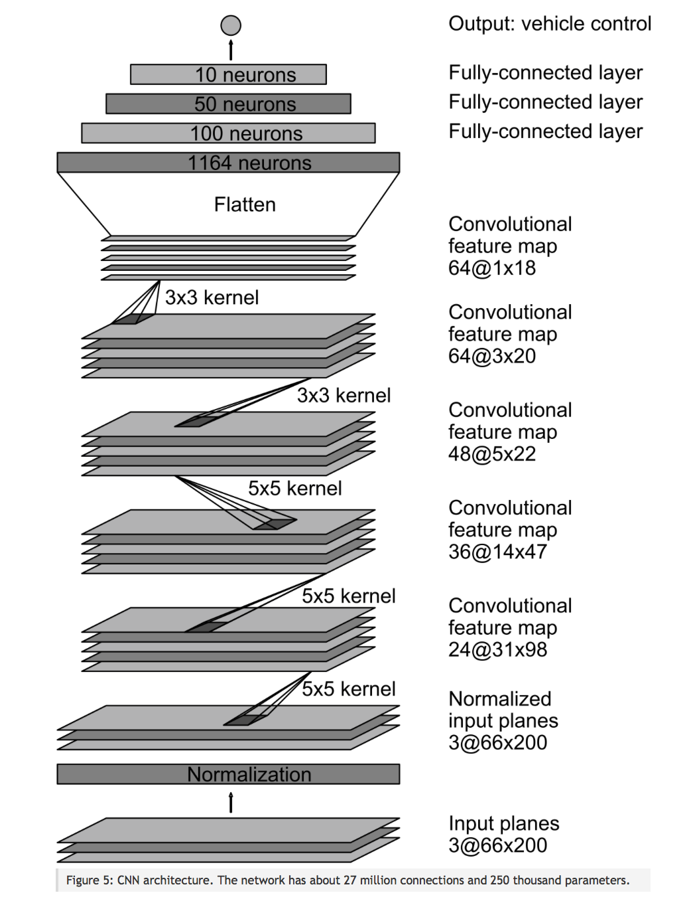</p>

In order to gauge how well the model was working, I split my image and steering angle data into a training and validation set with 4:1 ratio. I found that my first model had a low mean squared error on the training set but a high mean squared error on the validation set. This implied that the model was overfitting. 

## **Overfitting**
Overfitting was one of the main issues throughout this project:
To combat overfitting, I proceeded with several techniques:

#### 1. Reducing the density of the data from Track 1, through using data from the second track, to avoid overfitting on the first track and avoiding the model to only memorize driving around the first track.

#### 2. Regularizing the data's probability density:
1. Plotted the raw data's histogram:

<p align="center" height=100 width=100>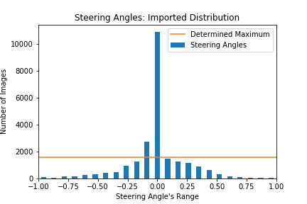</p>

2. Reduced the amount of data overshooting the scaled average by a range of experimented factors (1 --> 3), and choosing a factor of 1.5 as an optimum; Scaled Average = 1560 image/bin

<p align="center">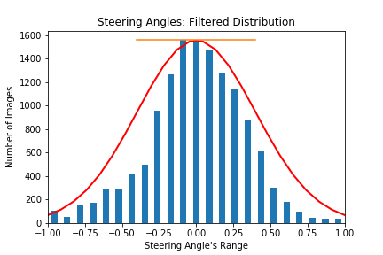</p>

3. Included images captured by the left and right cameras and adjusted the steering angle by a correction factor of 0.2. Plus, I flipped the each of the three images and applied a negative sign to the steering angles.

<p align="center">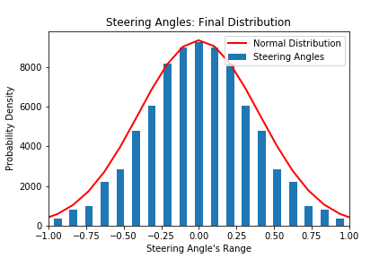</p>

* Although, the highest concentration of data was at the 0 steering angle, however, I think that the distribution resembled in this histogram, is a clean bell shape curve, representation of the steering angles propabilities with zero mean and standard deviation 0.4.
* This normal distribution of data, had a significant impact on the model's performance; cleaned up the noise shown in the car driving unsteadily through the tracks.
    
#### 3. Augmenting the Data: 
1. Through flipping each image and applying a negative sign to its angle.
    * Center Image with Steering Angle: 
    <p align="center">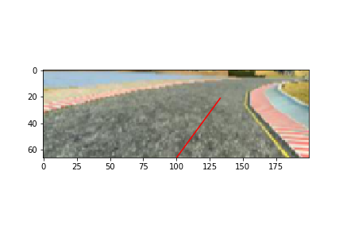</p>
2. Using the left and right cameras, and using a correction of 0.2 on the captured images' angles.
    * Image Representing Right Camera - Red Line is imported Steering Angle and Blue Line shows the correction 0.2:
    <p align="center">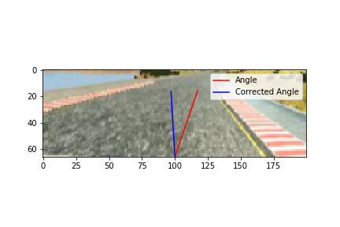</p>
3. Introducing a random brightness and dimming to each image to account for shadows and bright sections of each track.
    * Image with random brightness of -30 which dimms the image as shown:
    2<p align="center">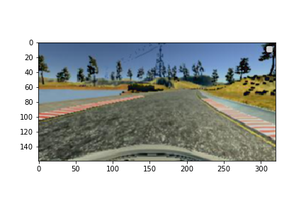</p>
4. Blurring each image with 3x3 kernel to reduce the impact of any textures on the training.
    <p align="center">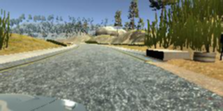</p>

#### 4. Batch normalization for each layer, to reduce the covariate shift of the outputs of each layer.

#### 5. Introducing L2 Regularization to each layer's weights of 0.001

#### 6. Used Early Stopping for the training epochs, so that as soon as the Validation Loss stops decreasing the training is terminated.
* The Green Line represents the saved model due to the `save_best_only=True` parameter in Keras Checkpoint callback function.
* The Early Stopping Callback function stopped the model at the 6th epoch since the Validation Loss stopped decreasing to avoid overfitting.

<p align="center">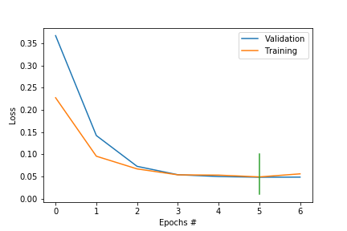</p>

### 7. Preprocessing each input image to the model (including test images):
1. Cropping to avoid learning any features other than the track itself.

<p align="center">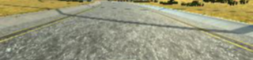</p>

2. Resizing to reduce the number of features input to the model and hence reducing the model complexity.

    * Cropped Image:
    <p align="right">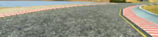</p>

    * Resized Cropped Image:
    <p align="right">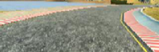</p>


The final step was to run the simulator to see how well the car was driving around track one. There were a few spots where the vehicle fell off the track... to improve the driving behavior in these cases, I ....

At the end of the process, the vehicle is able to drive autonomously around the track without leaving the road.

####2. Final Model Architecture

The final model architecture (model.py lines 18-24) consisted of a convolution neural network with the following layers and layer sizes ...

Here is a visualization of the architecture (note: visualizing the architecture is optional according to the project rubric)

![alt text][image1]

####3. Creation of the Training Set & Training Process

To capture good driving behavior, I first recorded two laps on track one using center lane driving. Here is an example image of center lane driving:

![alt text][image2]

I then recorded the vehicle recovering from the left side and right sides of the road back to center so that the vehicle would learn to .... These images show what a recovery looks like starting from ... :

![alt text][image3]
![alt text][image4]
![alt text][image5]

Then I repeated this process on track two in order to get more data points.

To augment the data sat, I also flipped images and angles thinking that this would ... For example, here is an image that has then been flipped:

![alt text][image6]
![alt text][image7]

Etc ....

After the collection process, I had X number of data points. I then preprocessed this data by ...


I finally randomly shuffled the data set and put Y% of the data into a validation set. 

I used this training data for training the model. The validation set helped determine if the model was over or under fitting. The ideal number of epochs was Z as evidenced by ... I used an adam optimizer so that manually training the learning rate wasn't necessary.
